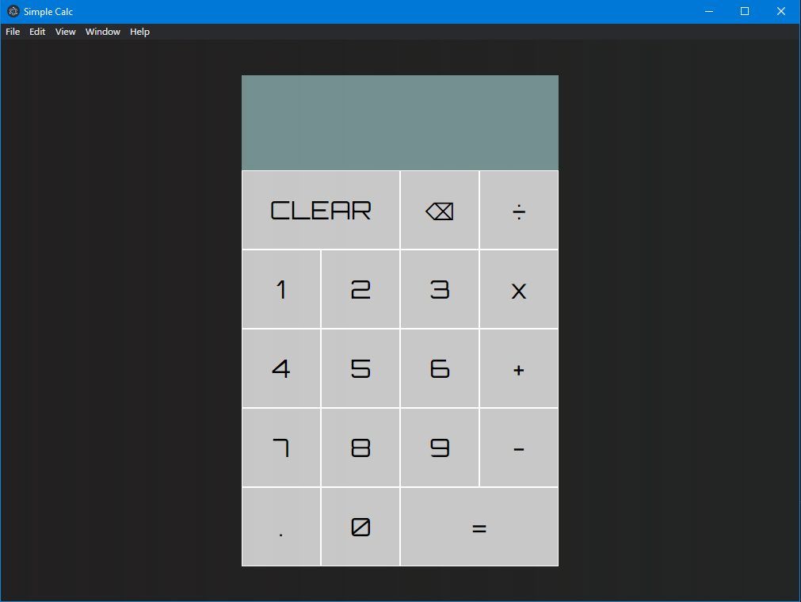

# Simple-Calc
Simple Calculator app for windows using Javascript &amp; HTML.

Downloading
**[Click Here To Download](https://github.com/INEX07/Simple-Calc/releases/download/v1.0/simple-calc-setup.exe)**

Installing
**Double click on the downloaded file then go through basic installation.**

Running
**Double Click on the program.**

It should look like this:

